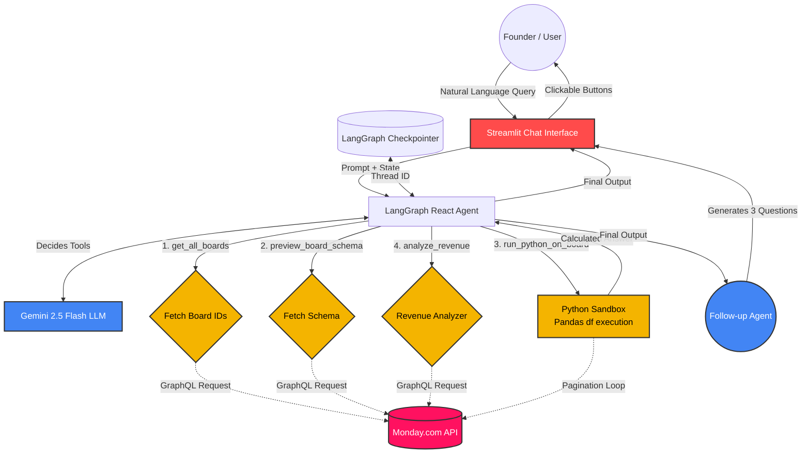

# Monday.com Business Intelligence Agent

## Overview
This repository contains my submission for the **Monday.com Business Intelligence Agent** Technical Assignment. The goal is to provide a conversational AI bot capable of answering founder-level BI queries by intelligently retrieving and analyzing messy business data from Monday.com boards (such as Work Orders and Deals).

The application is built using **Streamlit**, **LangGraph**, and **Google Gemini (2.5 Flash)**. It translates natural language questions into deterministic, hallucination-free mathematical calculations via an on-the-fly Python & Pandas execution environment.

---

## 🏗️ Architecture Architecture 

The system relies on a conversational agent loop that can discover boards dynamically, inspect their column schema, and then dynamically execute Python/Pandas logic to answer analytical questions accurately. 



---

## 🚀 Key Features

### 1. **Robust, Hallucination-Free Mathematics**
Instead of dumping raw JSON payloads into an LLM context window to arbitrarily "guess" aggregations, the agent has access to a `run_python_on_board` tool. 
- It first pulls the exact column layout using `preview_board_schema`. 
- Then, it writes deterministic Pandas scripts (e.g., `df[df['Deal Status'] == 'Open'].shape[0]`) against the downloaded data to ensure reliable math.
- It includes a self-healing error loop: if a written script throws an Exception or `KeyError`, the stack trace and DataFrame info are fed back to the LLM to rewrite and retry the execution.

### 2. **Dynamic API Discovery & Unlimited Pagination**
The agent no longer needs the user to provide exact Board IDs. When asked about a specific board by name (e.g., "Deal funnel Data"), the LLM dynamically searches Monday's database via the `get_all_boards` API tool.

Furthermore, the data injection loop iterates through Monday.com's newer `items_page` cursor-based pagination API, gracefully handling boards containing thousands of items instead of soft-locking at 500 records. 

### 3. **Intelligent Data Preprocessing**
The backend `clean_board_data` automatically aligns messy GraphQL responses into flattened, clean Pandas DataFrames. A generic numeric cleaner handles monetary symbols (`$` and `,`) ensuring that numerical operations can execute successfully regardless of minor human data entry inconsistencies.

### 4. **Human-in-the-Loop & Interactive Dashboard**
- **State Checkpointing:** By injecting a unique Thread ID and maintaining a `MemorySaver()` checkpointer in LangGraph, the Streamlit app achieves authentic persistent state across page reloads. A user can freely pause execution to refine the agent's context.
- **Suggested Follow-Ups:** Every time the main BI agent returns an answer, a secondary LLM pipeline generates exactly three context-aware follow-up questions. These are presented via clickable UI buttons to drive continuous data exploration.
- **Visible Tool Traces:** Streamlit Expander blocks render the exact tool callbacks made by the LLM in real-time, delivering complete audit transparency into the agent's thought process.

---

## 🛠️ Setup Instructions

### Prerequisites
- Python 3.10+
- A valid `GEMINI_API_KEY` supporting `gemini-2.5-flash`
- A valid `MONDAY_API_KEY` (Auth v2 token)

### Installation
1. Clone this repository.
2. Install the required dependencies:
   ```bash
   pip install -r requirements.txt
   ```
3. Copy your API keys into a Streamlit secrets file `.streamlit/secrets.toml`:
   ```toml
   GEMINI_API_KEY = "your_google_key_here"
   MONDAY_API_KEY = "your_monday_token_here"
   ```
4. Alternatively, you may place them in a `.env` file at the repository root.

### Running the App
Start the Streamlit interface locally:
```bash
streamlit run app.py
```
